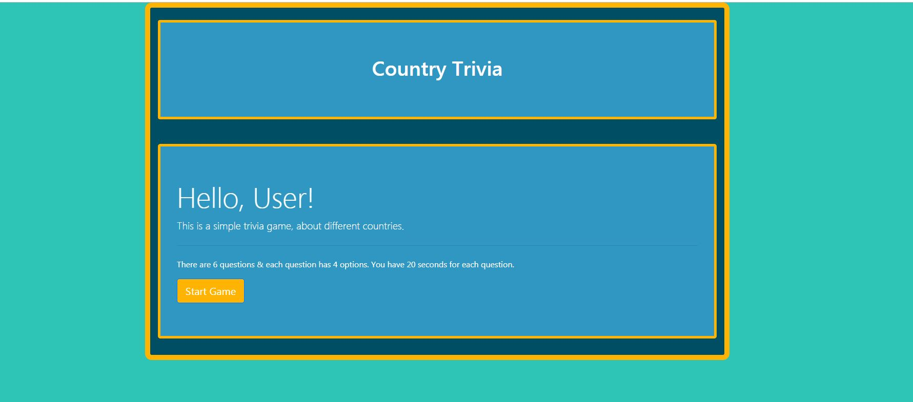
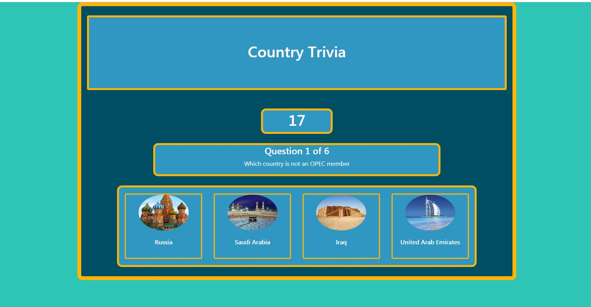
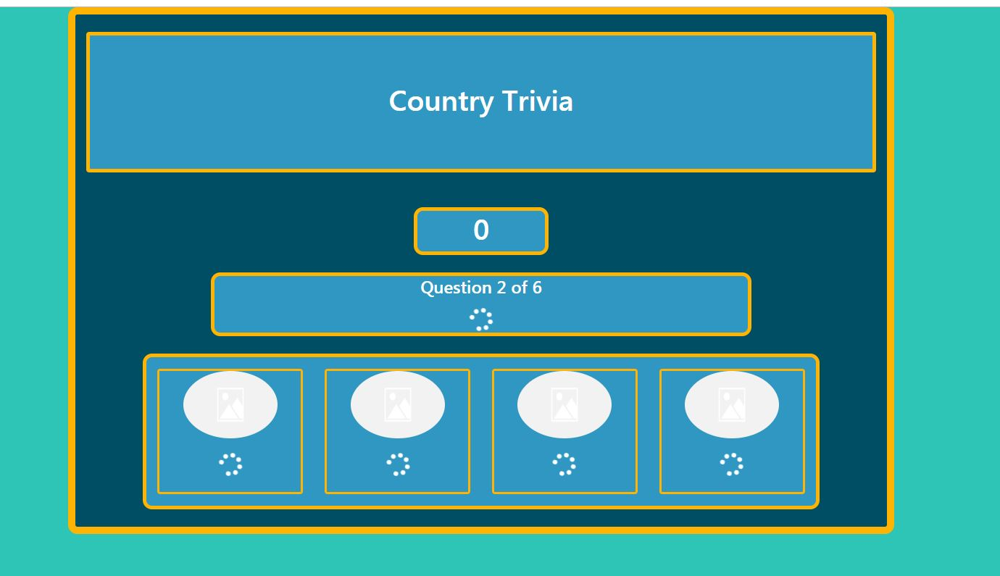
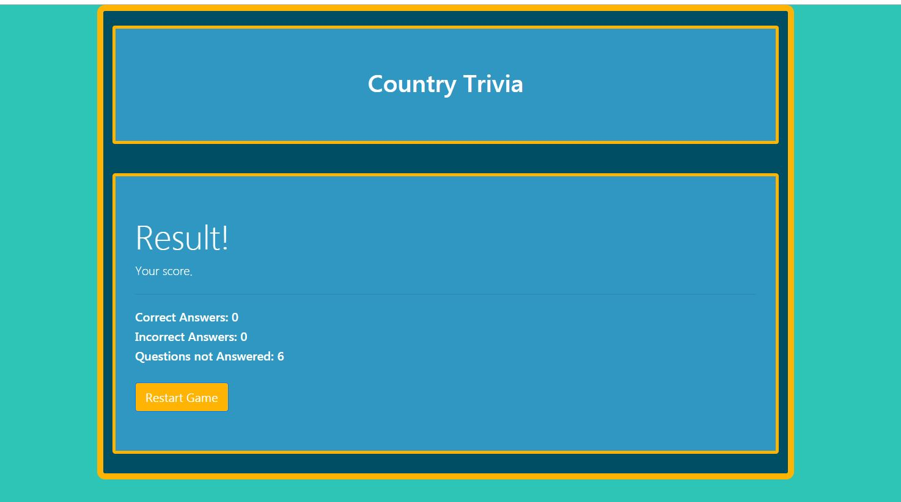

# Triva - Unit 5 HW

Welcome to the Trivia about countries. There are a total of 6 questions & each question has four options. You have 20 seconds per question to guess. Here is a link to the [game](https://anw1986.github.io/Trivia-Game/)

## Getting Started

This is a trivia game about countries. Each question presented has four options. The selects an answer or wait for the timer to run out until the next question is diplayed. After the last question a result screen pops up

Screen shot of the home screen

Screen shot of the question screen

Screen shot of the transition screen

Screen shot of the result screen

## Game Design Notes & User Tests

Every effort has been put in to design & capture user exceptions including
* Three **On Click** functions have been created
* Once the user selects an option, the user is unable to click on any other option
* Functions have been used in order to avoid repetitive statements
* There is a 3 second delay between one to question to another
* In betwen the transition, spinners have been added to indicate a transition is in progress
* If a question is not answered within 20 sec, the right answered before transitioning to a new question
* Restart button to reinstate variables and counter at default values

### Coding tests

The code has been thorougly checked but exceptions are always there. This HW has heavy uses of jquery and functions. 

Classes have been indexed to provide ease of use for jquery. A countdown timer has been created using the following function which is then called every second using the setInterval function inside the question funtion

'''
  
function countdown() {

        // countdown timer
        $("#countdown").html(count)
        if (count <= 0) {
            // Display answer when time runs out
            $(".fontawesome-" + [questionArray[11]]).css({
                "display": "inline-block"
            });
            clearInterval(a)
            console.log(a);
           
            setTimeout(transitionQuestion, 3000)
        }
        count--
    };

'''

Different Jquery methods to dynamincally update css

'''
  
  function transitionQuestion() {

        $(".card").find("i").removeClass("fas fa-check").addClass("fas fa-spinner fa-spin").css({
            "font-size": "2em",
            "display": "inline-block"
        })
        $(".card").find("i").removeClass("fas fa-times").addClass("fas fa-spinner fa-spin").css({
            "font-size": "2em",
            "display": "inline-block",
            "color": "white"
        })
        $(".questionDisplay").html("")
        $("#questionSpinner").removeClass("d-none")
        $(".card-img-top").attr("src", "./assets/images/default.png")
        $(".card-title").addClass("d-none")

        if (countquestion > 5) {
            clearInterval(a);
            showResult();
            return
        }

        setTimeout(transitionReset, 3000)

    }

'''

## Built With

* [Bootstrap](https://getbootstrap.com/) - To build responsive website

## Authors

* **Ahmed Waheed** - *Unit 5 HW* - [Github Profile](https://github.com/anw1986) -[Portfolio](https://anw1986.github.io/Basic-Portfolio/)

